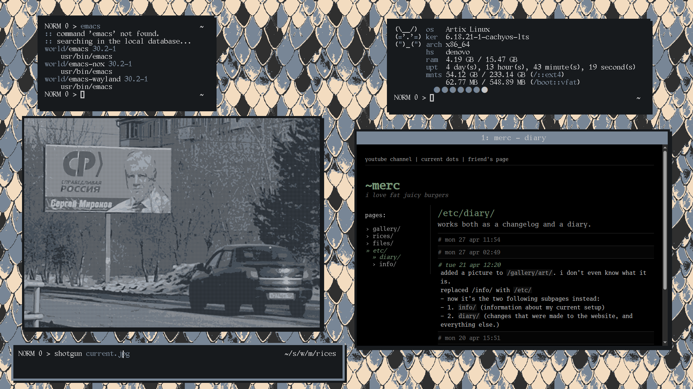

## my very uncool dots
raw. very raw. i don't have much to add to this. i don't know how to create patches/.diff files.

## setup info
```
           wm : i3
         font : https://github.com/NanoBillion/gallant
        shell : fish shell
       editor : neovim # my own config
      browser : qutebrowser
     terminal : alacritty
    wallpaper : https://github.com/uint23/dotfiles
   img viewer : feh
```
i will never use a bar.

## preview /// blueballs


# again. DO NOT USE THESE DIRECTLY.
